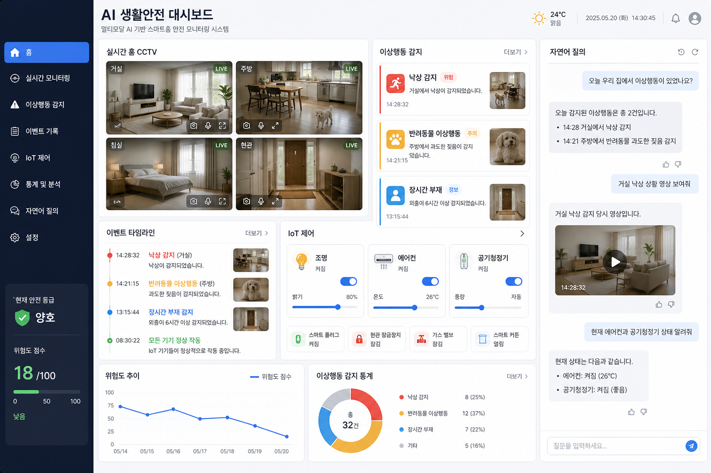
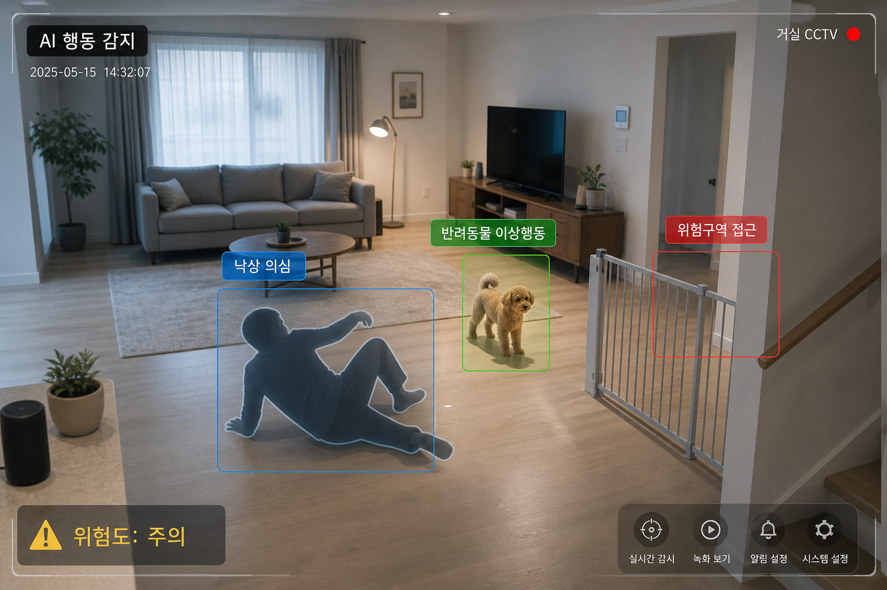
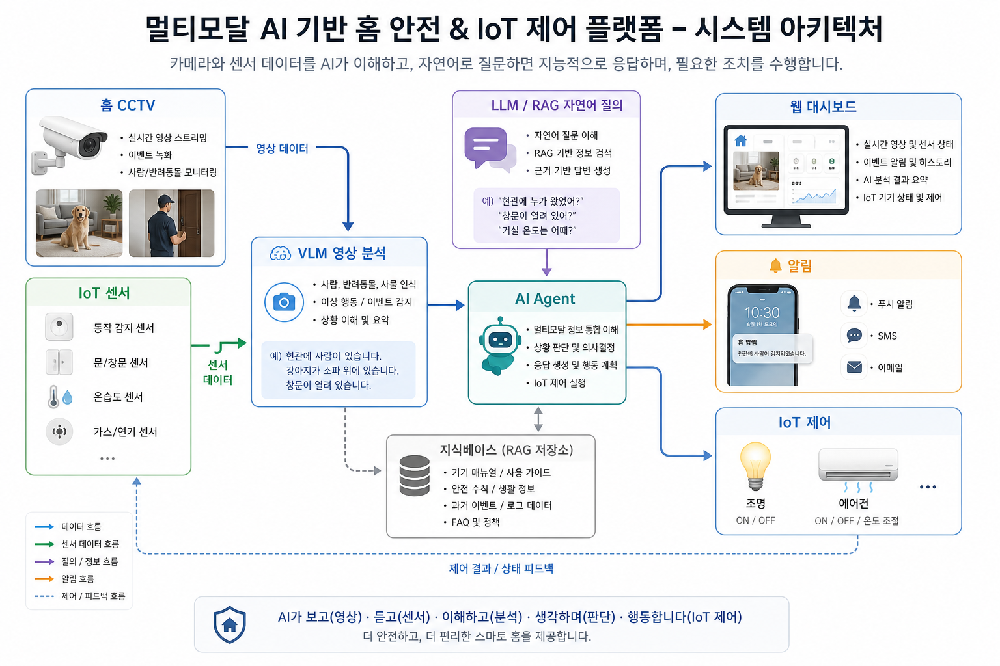

 # 홈 CCTV 기반 멀티모달 AI 생활안전 및 IoT 제어 대시보드

## 1. 프로젝트 개요

본 프로젝트는 홈 CCTV 영상과 IoT 기기 데이터를 기반으로 사람과 반려동물의 이상행동을 감지하고, 사용자가 자연어로 상황을 조회하거나 IoT 기기를 제어할 수 있는 웹 기반 AI 대시보드 프로토타입을 구현하는 것을 목표로 한다.

제안서의 핵심 방향인 `Vision AI`, `VLM`, `LLM`, `RAG`, `AI Agent`, `자연어 기반 인터페이스`, `웹 서비스 프로토타입`을 반영하여, 공공 CCTV 이상행동 탐지 기술을 가정용 생활안전 및 스마트홈 제어 서비스로 확장한 형태로 기획한다.

## 2. 프로젝트명

**홈 CCTV 기반 멀티모달 AI 생활안전 및 IoT 제어 대시보드**

## 3. 제안 배경

최근 CCTV, IoT 센서, 스마트홈 기기 보급이 확대되면서 가정 내 안전 관리와 에너지 효율화에 대한 수요가 증가하고 있다. 특히 반려동물의 이상행동, 사람의 낙상, 침입 의심 상황, 위험구역 접근 등은 실시간 확인이 어렵기 때문에 사고 발생 전 조기 감지와 대응이 필요하다.

기존 스마트홈 시스템은 주로 사용자가 직접 앱을 통해 기기를 제어하는 방식에 머무르는 경우가 많다. 본 프로젝트는 영상 분석 AI와 자연어 기반 AI 인터페이스를 결합하여, 사용자가 직접 모든 상황을 확인하지 않아도 AI가 위험 이벤트를 감지하고 요약하며 필요한 조치를 추천하거나 수행하는 서비스 구조를 제안한다.

## 4. 프로젝트 목표

홈 CCTV 영상 또는 샘플 이미지 데이터를 AI가 분석하여 사람과 반려동물의 이상행동을 감지하고, 사용자가 자연어로 상황을 조회하거나 IoT 기기를 제어할 수 있는 웹 기반 대시보드 프로토타입을 구현한다.

이를 통해 다음 흐름을 검증한다.

1. CCTV 영상 또는 이미지 입력
2. AI 기반 사람, 반려동물, 위험 행동 분석
3. 이상행동 이벤트 생성 및 저장
4. 웹 대시보드에서 실시간 상태 확인
5. 자연어 질의응답 및 이벤트 요약
6. IoT 기기 제어 또는 제어 시뮬레이션

## 5. 주요 기능

### 5.1 영상 및 이미지 분석

홈 CCTV 영상 또는 샘플 이미지를 기반으로 사람, 반려동물, 사물, 위험구역, 침입 의심 상황 등을 감지한다.

예시 기능:

- 사람 및 반려동물 객체 탐지
- 특정 공간 출입 감지
- 위험구역 접근 감지
- 장시간 움직임 없음 감지
- 낙상 의심 장면 감지
- 야간 침입 의심 이벤트 감지

### 5.2 이상행동 감지

영상 분석 결과를 바탕으로 사람과 반려동물의 문제행동 또는 위험상황을 이벤트로 분류한다.

예시 시나리오:

- 반려동물이 출입 제한 구역에 접근
- 반려동물이 장시간 움직이지 않음
- 사람이 거실에서 낙상한 것으로 의심됨
- 외출 중 현관에 낯선 사람이 접근
- 창문 또는 문이 열린 상태에서 움직임 감지
- 야간 시간대 비정상 움직임 감지

### 5.3 자연어 질의 인터페이스

사용자가 복잡한 메뉴를 조작하지 않아도 자연어로 상황을 조회할 수 있도록 한다.

예시 질문:

- "오늘 강아지가 혼자 있던 시간이 얼마나 돼?"
- "오늘 이상행동만 요약해줘."
- "낙상 의심 장면이 있었어?"
- "현관에 누가 왔었어?"
- "위험도가 높았던 시간대를 알려줘."
- "현재 에어컨과 공기청정기 상태 알려줘."

### 5.4 웹 대시보드

사용자는 웹 대시보드에서 실시간 상태와 분석 결과를 확인한다.

대시보드 구성:

- CCTV 화면 또는 샘플 이미지 분석 결과
- 이상행동 이벤트 목록
- 위험도 점수
- 이벤트 타임라인
- 감지 장면 캡처 이미지
- IoT 기기 상태
- 자연어 질의 채팅창
- AI 요약 및 보고서 생성 결과



### 5.5 IoT 제어 시뮬레이션

초기 프로토타입에서는 실제 IoT 기기를 직접 연결하지 않고, 대시보드에서 기기 상태를 시뮬레이션하는 방식으로 구현한다.

제어 대상 예시:

- 조명 ON/OFF
- 에어컨 ON/OFF 및 온도 조절
- 공기청정기 ON/OFF
- 스마트 플러그 제어
- 현관 잠금장치 상태 확인
- 위험 상황 발생 시 보호자 알림

예시 동작:

- 낙상 의심 이벤트 감지 시 거실 조명 ON
- 침입 의심 이벤트 감지 시 알림 전송
- 반려동물 장시간 혼자 있음 감지 시 공기청정기 작동
- 외출 모드에서는 냉난방 절전 모드 적용

## 6. AI 활용 방향

### 6.1 VLM

`VLM`은 이미지 또는 영상 프레임을 이해하고, 장면 안의 사람, 반려동물, 사물, 행동 상태를 설명하는 데 활용한다.

활용 예:

- "거실에 사람이 쓰러져 있는 것으로 보입니다."
- "강아지가 계단 앞 위험구역에 접근했습니다."
- "현관문 근처에 낯선 사람이 감지되었습니다."

### 6.2 LLM

`LLM`은 사용자의 자연어 질문을 이해하고, 이벤트 로그와 분석 결과를 바탕으로 답변을 생성한다.

활용 예:

- 이벤트 요약
- 위험상황 설명
- 사용자 질문 응답
- 일일 리포트 생성
- 대응 방안 추천

### 6.3 RAG

`RAG`는 저장된 이벤트 로그, IoT 기기 상태, 사용자 매뉴얼, 안전 기준 문서 등을 검색하여 답변의 근거를 보강하는 데 활용한다.

활용 예:

- 과거 이벤트 기반 질의응답
- IoT 기기 사용법 안내
- 반려동물 행동 기준 검색
- 생활안전 가이드 기반 대응 추천

### 6.4 AI Agent

`AI Agent`는 분석, 검색, 요약, 제어 기능을 연결하여 사용자의 요청을 단계적으로 처리한다.

예시:

사용자: "오늘 위험했던 상황 요약하고, 외출 모드로 바꿔줘."

AI Agent 처리 흐름:

1. 오늘 이벤트 로그 검색
2. 위험 이벤트 필터링
3. 요약 답변 생성
4. IoT 기기 상태 확인
5. 조명, 냉난방, 공기청정기 절전 설정
6. 대시보드에 처리 결과 표시

## 7. 기술 스택 제안

### 7.1 Frontend

**Next.js + React + TypeScript**

역할:

- 웹 대시보드 구현
- CCTV 분석 결과 화면 표시
- 이벤트 타임라인 UI 구현
- 자연어 질의 채팅 UI 구현
- IoT 기기 제어 UI 구현
- 위험도 통계 및 리포트 화면 구현

선정 이유:

- React 기반 UI 개발에 적합
- 대시보드, 채팅, 상태 관리 화면 구현이 용이
- TypeScript를 통해 컴포넌트와 API 응답 타입을 명확히 관리 가능

### 7.2 Backend

**FastAPI**

역할:

- 영상 및 이미지 업로드 API
- AI 분석 요청 API
- 자연어 질의 API
- 이벤트 로그 조회 API
- IoT 제어 API
- WebSocket 기반 실시간 알림 API

선정 이유:

- Python 기반이므로 AI 및 영상처리 라이브러리와 연동이 쉽다.
- `OpenCV`, `YOLO`, `VLM`, `LLM`, `RAG` 파이프라인을 같은 언어 환경에서 구성하기 좋다.
- API 문서 자동 생성이 가능하여 팀 개발과 멘토 검토에 유리하다.

### 7.3 Vision AI

**OpenCV + YOLO 계열 모델 + VLM**

역할:

- `OpenCV`: 영상 프레임 추출 및 전처리
- `YOLO`: 사람, 반려동물, 사물 등 객체 탐지
- `VLM`: 장면 이해, 행동 설명, 이상상황 판단 보조



### 7.4 Database

**PostgreSQL + Vector DB**

역할:

- `PostgreSQL`: 사용자 정보, 이벤트 로그, IoT 기기 상태, 분석 결과 저장
- `pgvector` 또는 `ChromaDB`: 이벤트 설명, 문서, 요약 정보의 임베딩 검색

저장 데이터 예:

- 이벤트 발생 시간
- 감지 위치
- 감지 객체
- 위험도 점수
- 캡처 이미지 경로
- AI 요약 결과
- 사용자 질문 및 답변 이력
- IoT 제어 이력

### 7.5 Realtime / IoT

**WebSocket + MQTT**

역할:

- `WebSocket`: 대시보드 실시간 이벤트 알림
- `MQTT`: IoT 기기 제어 메시지 송수신

초기 구현에서는 실제 IoT 기기 대신 `IoT device simulator`를 사용하여 조명, 에어컨, 공기청정기 등의 상태 변화를 시뮬레이션한다.

### 7.6 Deployment

**Docker**

역할:

- Frontend, Backend, Database, AI Worker를 컨테이너로 분리
- 팀원 간 동일한 실행 환경 구성
- 향후 배포 및 확장 용이

## 8. 시스템 아키텍처

```text
홈 CCTV / 샘플 영상
        ↓
FastAPI Backend
        ↓
OpenCV 프레임 추출
        ↓
YOLO / VLM 영상 분석
        ↓
이상행동 이벤트 생성
        ↓
PostgreSQL / Vector DB 저장
        ↓
LLM / RAG 자연어 질의응답
        ↓
Next.js 웹 대시보드
        ↓
알림 / 보고서 / IoT 제어
```



## 9. MVP 구현 범위

8주 프로젝트 기준으로 모든 기능을 완성형 서비스 수준으로 구현하기보다는, 핵심 흐름이 동작하는 프로토타입을 목표로 한다.

### 1차 MVP

- 샘플 이미지 또는 짧은 CCTV 영상 업로드
- 사람/반려동물 객체 탐지
- 이상행동 이벤트 더미 또는 간단한 규칙 기반 생성
- 이벤트 목록 및 캡처 이미지 대시보드 표시
- IoT 기기 상태 시뮬레이션

### 2차 MVP

- 자연어 질의응답 기능 추가
- 이벤트 로그 기반 요약 답변 생성
- 위험도 점수 및 통계 표시
- WebSocket 기반 실시간 알림

### 고도화 가능 범위

- 실제 CCTV 스트리밍 연동
- 실제 IoT 기기 또는 MQTT 브로커 연동
- VLM 기반 장면 설명 자동 생성
- RAG 기반 생활안전 가이드 답변
- 일일/주간 자동 보고서 생성
- 반려동물 행동 데이터셋 기반 이상행동 분류 고도화

## 10. 예상 결과물

- 프로젝트 기획서
- 기능 정의서
- 웹 대시보드 UI 프로토타입
- CCTV 영상/이미지 분석 데모
- 자연어 질의응답 데모
- IoT 제어 시뮬레이션 화면
- 시스템 아키텍처 설계안
- 최종 발표자료

## 11. 기대 효과

본 프로젝트는 제안서에서 요구하는 멀티모달 AI, Vision AI, LLM, 자연어 인터페이스, AI 서비스 프로토타입의 방향과 부합한다. 또한 공공 CCTV 이상행동 탐지 기술을 가정용 생활안전 서비스로 확장한 사례로 설명할 수 있다.

기대 효과:

- 사람과 반려동물의 위험상황 조기 감지
- 보호자의 실시간 확인 부담 감소
- 자연어 기반 직관적 서비스 사용 경험 제공
- 영상 분석 결과와 IoT 제어의 연계 가능성 검증
- 향후 독거노인 케어, 반려동물 모니터링, 스마트빌딩 보안, 시설 안전관리 분야로 확장 가능

## 12. 제안서와의 정합성

본 아이디어는 제안서의 다음 요소와 연결된다.

- `공공 CCTV 이상행동 탐지`: 홈 CCTV 기반 이상행동 감지로 확장
- `Vision AI`: 영상 및 이미지 분석 기능으로 반영
- `VLM`: 장면 이해 및 행동 설명에 활용
- `LLM`: 자연어 질의응답, 요약, 보고서 생성에 활용
- `RAG`: 이벤트 로그와 안전 기준 문서 기반 답변 보강에 활용
- `AI Agent`: 분석, 요약, IoT 제어를 연결하는 자동화 흐름에 활용
- `UI/UX 설계`: 웹 대시보드와 자연어 질의 화면으로 구현
- `기능별 프로토타입`: 영상 분석, 질의응답, IoT 제어 시뮬레이션으로 구현

## 13. 한 줄 요약

홈 CCTV 영상을 AI가 분석해 사람과 반려동물의 이상행동을 감지하고, 사용자가 자연어로 상황을 확인하거나 IoT 기기를 제어할 수 있는 멀티모달 AI 생활안전 대시보드이다.
